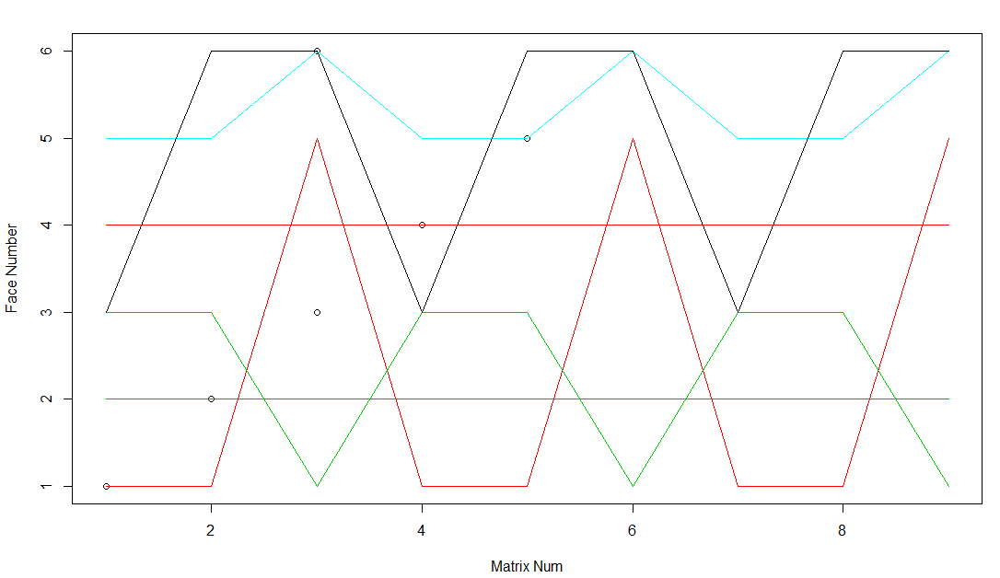

# Rubik Cube Simulation


Rubik cube is 3D pazzel invented by professor of architecture Erno Rubik in 1974. It has approximately 43 quintillion different arrangments (status). To put this into perspective, if one had one standard-sized Rubik's Cube for each status, one could cover the Earth's surface 275 times, or stack them in a tower 261 light-years high.

The standard rubik cube has 6 faces, on each face has 9 fixed colors. The standard moves are R(turning clokewise) and R'(turn-counterclockwise) These two moves can be apploied to each face which generate different moves which are called R(right), R'(reverse-right), L(left),L'(reverse-left), U, U', B, B' and so on...
Two Rubik cube computer models developed for 3 * 3 and N * N cubes.
 
---
## Rubik cube with 3 * 3 dimensions:
The program steps are provided at the following:
* Generate a random integer between 1 and 6 (NumOfFaces). 
* Chose the face randomly that the move gonna be committed on.
* Generate a random integer between 1 and 2. The 1 clockwise turns and 2 is counterclockwise.
* Committee moves on the Rubik cube Face and updates the superposition matrix. Or you may apply your favorite move and do sensitivity analysis
The Moves are committed based on the Face and move direction. 

The first building block of the program is provided at the following. A similar procedure is taken for the rest 5 Faces of Rubik cube.

Commit moves on Face_1.

```R
  if (Face ==1){

    if (Move ==1){
      #update face corners
      M_SuperPosition[1,1] <- M[1,7]
      M_SuperPosition[1,3] <- M[1,1]
      M_SuperPosition[1,9] <- M[1,3]
      M_SuperPosition[1,7] <- M[1,9]
      #update face edge
      M_SuperPosition[1,2] <- M[1,4]
      M_SuperPosition[1,6] <- M[1,2]
      M_SuperPosition[1,8] <- M[1,6]
      M_SuperPosition[1,4] <- M[1,8]

      #update Edge#1
      M_SuperPosition[5,7] <- M[2,9]
      M_SuperPosition[4,1] <- M[5,7]
      M_SuperPosition[3,3] <- M[4,1]
      M_SuperPosition[2,9] <- M[3,3]
      #update Edge#2
      M_SuperPosition[5,8] <- M[2,6]
      M_SuperPosition[4,4] <- M[5,8]
      M_SuperPosition[3,2] <- M[4,4]
      M_SuperPosition[2,6] <- M[3,2]
      #update Edge#3
      M_SuperPosition[5,9] <- M[2,3]
      M_SuperPosition[4,7] <- M[5,9]
      M_SuperPosition[3,1] <- M[4,7]
      M_SuperPosition[2,3] <- M[3,1]

    }
    else {
      #update face corners
      M_SuperPosition[1,1] <- M[1,3]
      M_SuperPosition[1,3] <- M[1,9]
      M_SuperPosition[1,9] <- M[1,7]
      M_SuperPosition[1,7] <- M[1,1]
      #update face edge
      M_SuperPosition[1,2] <- M[1,6]
      M_SuperPosition[1,6] <- M[1,8]
      M_SuperPosition[1,8] <- M[1,4]
      M_SuperPosition[1,4] <- M[1,2]

      #update Edge#1
      M_SuperPosition[5,7] <- M[4,1]
      M_SuperPosition[4,1] <- M[3,3]
      M_SuperPosition[3,3] <- M[2,9]
      M_SuperPosition[2,9] <- M[5,7]
      #update Edge#2
      M_SuperPosition[5,8] <- M[4,4]
      M_SuperPosition[4,4] <- M[3,2]
      M_SuperPosition[3,2] <- M[2,6]
      M_SuperPosition[2,6] <- M[5,8]
      #update Edge#3
      M_SuperPosition[5,9] <- M[4,7]
      M_SuperPosition[4,7] <- M[3,1]
      M_SuperPosition[3,1] <- M[2,3]
      M_SuperPosition[2,3] <- M[5,9]
    }
    #update M
    M <- M_SuperPosition
  }

```
---
Once the moves are commited the resuls are ploted in 2 * 3 figure as prvodied at the following.

<p align="center">
  
</p>


---
### Rubik cube with N * N dimensions:
